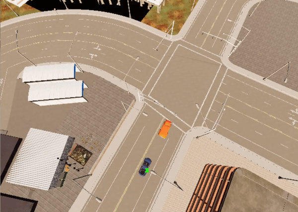

The goal of this venture is to develop models capable of completing a variety of autonomous tasks within the Carla simulator using reinforcement learning methods. The repository is divided into two distinct projects which are still being developed.

# A to B
Autonomous ride from point A to B.
Trained models (see A_to_B/final_models) are able to correctly perform fundamental road manoeuvres such as driving straight, turning left and right.
Using this knowledge, the models can learn how to beat different scenarios in a reasonable amount of time, depending on the scenario's complexity.

Examples of some fundamental road manoeuvres:

  
  
  
  

Example of a more challenging scenario:

  

# Chase
Autonomous chase of a fleeing vehicle.
This project followed a similar approach to learning. However, autonomous chasing proved to be more challenging than getting from point A to point B, and work on training a satisfactory model continues.

Examples of some fundamental road manoeuvres:

  
  
  

## Technologies
* Python 3.7
* PyTorch 1.8.1+cu111
* Carla 0.9.10 (Probably compatible with the latest versions)

